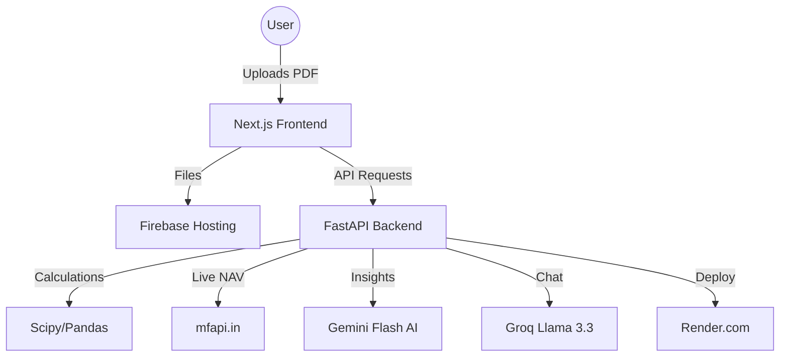

# 🔍 MF Portfolio X-Ray — AI Money Mentor

> Upload your CAMS statement → Get your entire financial life analyzed in 10 seconds.


---

## 🚀 What It Does

Most mutual fund investors don't know the **truth** about their portfolio. MF X-Ray changes that.

| Feature | What You Get |
|---|---|
| **True XIRR** | Your real return (not the inflated number Groww shows) |
| **Diversification Illusion** | How many *actual* unique stocks you hold across all funds |
| **Expense Drain** | How much you're losing to Regular Plan commissions (in ₹) |
| **Tax Harvesting** | Unrealized losses you can book before March 31 to save tax |
| **Goal Meter** | Probability of reaching your goal + rebalancing actions |
| **AI Advisor** | Gemini Flash-powered insights + Groq Llama 3.3 live chat |

---

## 🏗️ Tech Stack

### Frontend
- **Next.js 14** (App Router)
- **Tailwind CSS**
- **Recharts** — Portfolio charts
- **Framer Motion** — Animations
- **react-dropzone** — PDF upload

### Backend
- **FastAPI** (Python)
- **pdfplumber** — CAMS PDF parsing
- **scipy** — XIRR calculation (Brent's method)
- **pandas** — Transaction data processing

### AI (Free Tier)
- **Google Gemini Flash** — Portfolio insights & rebalancing advice
- **Groq Llama 3.3** — Live "ask anything" portfolio chat

### Data Sources (Free)
- **mfapi.in** — Live NAV data for all Indian mutual funds
- **AMFI India** — Fund holdings & categories

---

## 📁 Project Structure

```
PROJECT/
├── frontend/                   # Next.js 14 app
│   ├── app/
│   │   ├── page.tsx           # Landing page + upload
│   │   ├── analyze/page.tsx   # Results dashboard
│   │   └── layout.tsx
│   ├── components/
│   │   ├── FileUpload.tsx
│   │   ├── XirrCard.tsx
│   │   ├── OverlapChart.tsx
│   │   ├── ExpenseDrain.tsx
│   │   ├── TaxHarvest.tsx
│   │   ├── GoalMeter.tsx
│   │   ├── AIInsights.tsx
│   │   └── ChatBot.tsx
│   └── package.json
│
├── backend/                    # FastAPI Python backend
│   ├── main.py                # API routes + CORS
│   ├── parsers/
│   │   └── cams_parser.py    # CAMS PDF extraction
│   ├── calculators/
│   │   ├── xirr.py           # True XIRR (Brent's method)
│   │   ├── overlap.py        # Fund stock overlap
│   │   ├── expense.py        # Expense ratio drain
│   │   ├── tax_harvest.py    # Tax loss harvesting
│   │   └── goal_planner.py   # Goal probability + rebalancing
│   ├── data_fetchers/
│   │   └── mfapi_client.py   # Live NAV from mfapi.in
│   ├── ai/
│   │   └── gemini_insights.py # Gemini Flash + Groq integration
│   ├── requirements.txt
│   └── .env.example
│
├── .gitignore
└── README.md
```

---

## ⚙️ Setup & Run Locally

### 1. Clone the repo
```bash
git clone https://github.com/YOUR_USERNAME/mf-xray.git
cd mf-xray
```

### 2. Backend Setup
```bash
cd backend

# Create virtual environment
python -m venv venv
venv\Scripts\activate        # Windows
# source venv/bin/activate   # Mac/Linux

# Install dependencies
pip install -r requirements.txt

# Set up environment variables
copy .env.example .env
# Edit .env and add your API keys
```

### 3. Add API Keys to `backend/.env`
```env
GEMINI_API_KEY=your_gemini_api_key_here
GROQ_API_KEY=your_groq_api_key_here
FRONTEND_URL=http://localhost:3000
```

**Getting free API keys:**
- Gemini Flash: [aistudio.google.com](https://aistudio.google.com) → Get API Key (free)
- Groq Llama 3.3: [console.groq.com](https://console.groq.com) → Create API Key (free)

### 4. Start the Backend
```bash
cd backend
uvicorn main:app --reload --port 8000
```
Backend runs at: `http://localhost:8000`

### 5. Frontend Setup
```bash
cd frontend
npm install
npm run dev
```
Frontend runs at: `http://localhost:3000`

---

## 🌐 Deployment

### Frontend → Firebase Hosting (Free)
1. Go to [console.firebase.google.com](https://console.firebase.google.com) → Create Project
2. Install Firebase CLI: `npm install -g firebase-tools`
3. Run `firebase login`
4. Set root directory to `frontend`
5. Run `npm run build` (This creates the `out` directory)
#### Firebase CI/CD (GitHub Actions)
The project includes a production-ready CI/CD pipeline using GitHub Actions to automatically deploy your frontend to Firebase Hosting on every `push` to the `main` branch.

**Required GitHub Secrets:**
Go to your **GitHub Settings** → **Secrets and variables** → **Actions** and add:
- `FIREBASE_SERVICE_ACCOUNT_FOLIOX_001`: Your Firebase Service Account JSON (Get from Firebase Console → Settings → Service Accounts → Generate new private key).
- `NEXT_PUBLIC_API_URL`: Your Render backend URL.
- `NEXT_PUBLIC_FIREBASE_API_KEY`: Your Firebase configuration. (And other `NEXT_PUBLIC_FIREBASE_*` variables used in `app/firebase.ts`).

### Backend → Render (Free)
1. Go to [render.com](https://render.com) → New Web Service → Connect GitHub repo
2. Set **Root Directory** to `backend`
3. Set **Build Command**: `pip install -r requirements.txt`
4. Set **Start Command**: `uvicorn main:app --host 0.0.0.0 --port $PORT`
5. Add env variables: `GEMINI_API_KEY`, `GROQ_API_KEY`, `FRONTEND_URL`
6. Deploy ✅
   > [!TIP]
   > Use [uptimerobot.com](https://uptimerobot.com) to ping your Render URL every 10 min to prevent the 30s cold-start delay during your demo.

---

## 📊 API Endpoints

| Method | Endpoint | Description |
|---|---|---|
| `POST` | `/api/analyze` | Upload CAMS PDF → full portfolio analysis |
| `POST` | `/api/analyze/demo` | Load demo portfolio (no PDF needed) |
| `POST` | `/api/chat` | Ask anything about your portfolio (Groq) |
| `GET` | `/api/nav/{scheme_code}` | Live NAV for any fund |
| `GET` | `/health` | Health check |

---

## 💡 Demo

The app includes a **pre-analyzed demo portfolio** so judges can see everything instantly without uploading a PDF. Click **"Try Demo Portfolio"** on the homepage.

---

## 🔐 Privacy

- PDFs are processed in-memory and **never stored** on any server
- No user data is saved to any database
- All analysis happens in real-time per request

---

---

## 🏗️ Architecture Diagram


---

## 💰 Business Impact & Market Size
*   **Target Market**: 4 Crore+ Indian Mutual Fund investors.
*   **The Problem**: 95% of retail investors have no idea about their true XIRR or regular-plan fee leak.
*   **Value Prop**: Average MF investor loses ₹21 Lakhs over 20 years to fees. FolioX identifies this in 10 seconds.
*   **Revenue Model**: SaaS for premium tax-saving strategies + B2B for Registered Investment Advisors (RIAs).
*   **Market Opportunity**: At 1% penetration of the professional segment, this addresses a **₹200 Crore market**.

---

## 📄 License
MIT License
